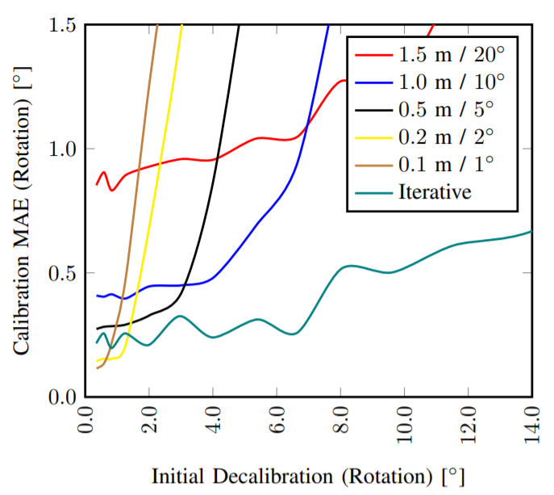

# Results

Trained on a 2GB RAM NVIDIA GeForce GTX 1050

## Dataset

* **Training**:
    * **Date**: 2011/09/26
    * **Drives**: [1, 2, 9, 11, 13, 14, 15,
               17, 18, 19, 20, 22, 23,
               27, 28, 29, 32, 35, 36, 39,
               46, 48, 51, 52, 56, 57,
               59, 60, 61, 64, 79,
               84, 86, 87, 91, 93, 95,
               96, 101, 104, 106, 113,
               117, 119]
* **Validation**:
    * **Date**: 2011/09/26
    * **Drives**: [5, 70]

* **Testing**:
    * **Date**: 2011/09/30
    * **Drives**: [28]

## Model A

### Training Settings
* **Model**: RegNet_v1
* **Epochs**: 4
* **Learning Rate**: 3e-4
* **Batch Size**: 4
* **Shuffle**: True
* **Quat Factor**: 1
* **Initial Decalibration Range**
    * **Rotation**: [-5, 5]
    * **Translation**: [-0.5, 0.5]
* **Image Reize**:
    * **Width**: 621
    * **Height**: 188

## Results

### Paper Results

### Validation Error

Metrics reported are **(Mean Translational Error/Mean Rotational Error)**.

<table>
  <tr>
    <th>Model</th>
    <th colspan="7">Fixed Decalibration (Trans/Rot)</th>
  </tr>
  <tr>
    <td></td>
    <td>0.1/1</td>
    <td>0.2/2</td>
    <td>0.4/4</td>
    <td>0.5/5</td>
    <td>0.6/6</td>
    <td>0.8/8</td>
    <td>1.0/10</td>
  </tr>
  <tr>
    <td>A</td>
    <td>0.06817/0.8616</td>
    <td>0.09363/1.1951</td>
    <td>0.1328/1.9484</td>
    <td>0.1872/2.4203</td>
    <td>0.2838/2.9964</td>
    <td>0.5410/4.325</td>
    <td>0.7347/5.5406</td>
  </tr>
</table>